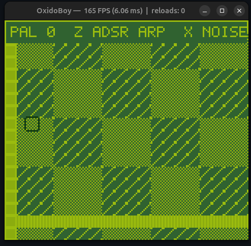

# OxidoBoy — Rust Fantasy Console

*A Game Boy–style fantasy console built in Rust. Write games in Rust, compile to WebAssembly, and run them inside the OxidoBoy runtime.*

---

## Requirements
- Rust (stable)
- WebAssembly target:
  ```bash
  rustup target add wasm32-unknown-unknown
  ```

## Project layout
```
.
├─ oxido_core/     # Runtime (Wasmtime + pixels + winit + cpal, hot-reload)
├─ oxido_sdk/      # Game-side helpers (framebuffer, palettes, sprites, tilemap, text)
├─ oxido_cli/      # `oxido` command-line tool (run/new/pack)
└─ examples/
   └─ hello_square/  # Playable example using the whole stack
```

## Quick start

Build and run the example cartridge:

```bash
# 1) Build workspace
cargo build --release

# 2) Package the example into a .cart folder
cargo run -p oxido_cli -- pack examples/hello_square

# 3) Run the .cart folder
cargo run -p oxido_cli -- run examples/hello_square/build/cart
```

You can also run a raw `.wasm` directly (specifying framebuffer size if needed):

```bash
cargo run -p oxido_cli -- run path/to/game.wasm --width 160 --height 144
```



## CLI usage

```text
oxido new <NAME>
  Scaffold a minimal WASM game crate that depends on `oxido_sdk`. 

oxido run <PATH> [--width <W> --height <H>]
  Run a game from a .wasm file or a .cart folder containing manifest.toml.

oxido pack <GAME_DIR> [--out <DIR>]
  Build the game for wasm32-unknown-unknown (release) and assemble a .cart folder
  with manifest + game.wasm + assets.
```

**NOTE**: When using ```oxido new``` in development, you need to add the new module to ```cargo.toml```. Also, ensure that the new game's ```cargo.toml``` file has the correct path to the oxido_sdk.

## Writing a game (ABI)

Games are `cdylib` crates that export a minimal ABI. The runtime calls:

```rust
// required
extern "C" {
    fn oxido_init();
    fn oxido_update(dt_ms: f32);
    fn oxido_draw_ptr() -> *const u8;  // RGBA framebuffer base pointer
    fn oxido_draw_len() -> usize;      // size in bytes (w*h*4)
    fn oxido_input_set(bits: u32);     // input bitfield (see table)
}

// optional (audio state the host will read every frame)
extern "C" {
    fn oxido_audio_state_ptr() -> *const u8; // 4 channels × 13 fields × 4 bytes
    fn oxido_audio_state_len() -> usize;
}
```

**Default resolution:** 160×144 (GB-like).  
**Framebuffer format:** RGBA8 (little-endian in memory).  
**Hot reload:** the runtime watches the `.wasm` mtime and re-instantiates on change.

### Input bitfield (host → game)

| Bit | Key       | Typical keyboard |
|-----|-----------|------------------|
| 0   | Up        | ↑                |
| 1   | Down      | ↓                |
| 2   | Left      | ←                |
| 3   | Right     | →                |
| 4   | A         | Z                |
| 5   | B         | X                |
| 6   | Start     | Enter            |
| 7   | Select    | Shift            |

### Cartridge format (`.cart` folder)

```
my_game.cart/
├─ manifest.toml
├─ game.wasm
└─ assets/           # optional (copied by `oxido pack`)
```

`manifest.toml` example:
```toml
title = "My Oxido Game"
version = "0.1.0"
width = 160
height = 144
scale = 3
wasm = "game.wasm"
```

## SDK highlights (`oxido_sdk`)

- **Frame**: simple drawing over RGBA8 (clear, rect, 5×7 text).
- **Palette**: 4-color palettes with helpers (`rgba`, GB-like defaults).
- **SpriteAtlas**: indexed (0..=3) tiles with blitting (flip X/Y, transparent 0).
- **TileMap**: scrolling, wrap-around.
- **Input helpers**: `Key` enum + `key_bit(Key)`.

See `examples/hello_square` for a complete cartridge using palettes, tilemap, collisions, HUD, and audio.

## Development workflow

- Run the runtime against your `.wasm`, keep your game crate open in another terminal:
  ```bash
  cargo run -p oxido_cli -- run path/to/game.wasm --width 160 --height 144
  # in your game crate:
  cargo build --release --target wasm32-unknown-unknown
  # OxidoBoy hot-reloads the wasm when mtime changes
  ```

- Per-project default target (optional):
  ```toml
  # .cargo/config.toml
  [build]
  target = "wasm32-unknown-unknown"
  ```

## Window scaling

Use `--scale N` to set a pixel-perfect scale for the window.

- **Default:** `3`.
- **When running a `.wasm`:** the manifest is ignored. Use `--scale`.
- **When running a `.cart` folder:** you can set `scale = N` in `cart/manifest.toml`.
  - If `scale` exists in the manifest, it **takes precedence** over the CLI flag.
  - If `scale` is not in the manifest, the CLI flag (or the default `3`) is used.

#### Examples

```bash
# Run a raw .wasm (use CLI flag)
cargo run -p oxido_cli -- run path/to/game.wasm --width 160 --height 144 --scale 4

# Run a .cart (uses scale from manifest if present)
cargo run -p oxido_cli -- run path/to/cart

# Run a .cart and try to override by CLI (ignored if manifest has scale)
cargo run -p oxido_cli -- path/to/cart --scale 5
```

## License

MIT © 2025 Jefferson Leon